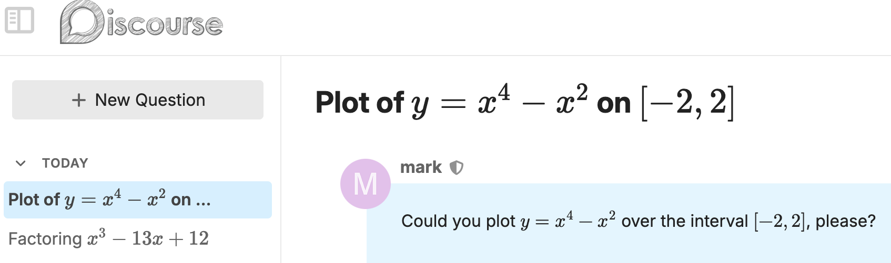

# discourse-katex-titles

## Theme summary

Uses KaTeX to typeset mathematical input in a title in a Discourse forum.

### Front page

### A topic page

### A scrolled topic page

### AI Bot sidebar

This branch applies KaTeX to the AI Bot sidebar as well:

Note, though, that getting LaTeX into the title is a bit of a trick itself. It seems that [there's no way to customize how automatic PM titles work](https://meta.discourse.org/t/automatic-and-bad-pm-conversation-titles/315909/2). To do so requires forking and editing the discourse-ai plugin itself.